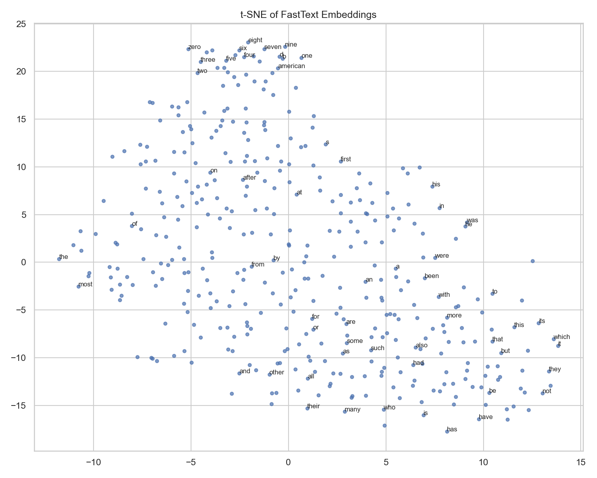

# FastText Subword Embeddings Trained from Scratch

[](LICENSE)

**Repository:** [github.com/bachnguyennn/Fast-Text-Embedding-System](https://github.com/bachnguyennn/Fast-Text-Embedding-System)

A from-scratch **PyTorch** implementation of Skip-Gram with Negative Sampling and **FastText subword n-grams**, trained on the [text8](http://mattmahoney.net/dc/text8.zip) corpus. The same pipeline trains a plain Skip-Gram baseline and a FastText variant, then benchmarks both against **official pre-trained FastText** and **GloVe 300d**.

---

## Key takeaways

| What this project shows | Why it matters |
|-------------------------|----------------|
| **End-to-end implementation** | Tokenizer, vocabulary, negative sampling, subword composition, training, export, and evaluation—without hiding behind a single `gensim.train` call. |
| **Controlled comparison** | Skip-Gram vs FastText on **identical** text8 data, dimensions, and epochs—isolates the effect of character n-grams. |
| **Honest benchmarking** | Official models score far higher on analogies (~71% vs ~11%); the gap is explained by **data scale**, not hand-waving. |
| **Where subwords help** | Better **coverage**, more analogy questions answered, and stronger **morphological** neighbors—even when WordSim-353 ρ is similar or slightly lower than Skip-Gram. |

**Bottom line:** The absolute scores are **not state-of-the-art**, but the **experimental design and engineering** are portfolio-grade: build it, measure it, compare fairly, and interpret limitations clearly.

---

## Why this project matters

Word embeddings power search, recommendation, and downstream NLP. **FastText** is widely used in production, yet many practitioners only download pre-trained vectors. This repository shows you can **derive the same ideas from first principles**: represent a word as a vector plus its character n-grams, train with negative sampling, and evaluate with standard intrinsic benchmarks.

The value is not beating Facebook’s Wikipedia-scale model on a laptop. The value is demonstrating that you understand **what changes** when you add subwords, **how to implement it correctly**, and **how to report results** when your model is weaker than an off-the-shelf baseline.

---

## Motivation

Classic Skip-Gram (Word2Vec) assigns one vector per word type. That fails on rare tokens, typos, and out-of-vocabulary forms. **FastText** augments each word with the mean of its character n-gram vectors (typically lengths 3–6), so related surface forms can share statistical strength.

This repo implements that pipeline in PyTorch—subsampling, streaming training on full text8, MPS acceleration, Word2vec-compatible export, and a four-model evaluation harness—so the Skip-Gram vs FastText contrast is measurable, not anecdotal.

---

## Architecture

```
Input word "where"
  ├── word embedding:     E_word["where"]
  └── subword embeddings: E_sub["<wh"], E_sub["<whe"], ... , E_sub["ere>"]
  => input vector = E_word + mean(E_sub[ngrams])

Skip-Gram + Negative Sampling:
  maximize log σ(v_center · v_context) + Σ log σ(-v_center · v_negative)
```

---

## Project structure

```
fasttext_embeddings_from_scratch/
├── src/                    # tokenizer, vocab, dataset, model, trainer, device
├── evaluation/             # WordSim-353, SimLex-999, Google analogies, comparison
├── scripts/                # train, export, baselines, figures, post-train pipeline
├── notebook/               # exploratory report (EDA, training, benchmarks)
├── reports/figures/        # plots embedded in this README
├── models/                 # .vec / .pt artifacts (gitignored)
└── train.py, evaluate.py, visualize.py
```

---

## Training configuration (final models)

These are the **published** embeddings: **300 dimensions**, **10 epochs**, **full text8** with Word2vec subsampling (~4.98M tokens per epoch).

| Setting | Value |
|---------|-------|
| Corpus | text8 — 17,005,279 raw tokens |
| Subsampling | threshold `1e-5` → ~4.98M tokens / epoch |
| Epochs | **10** (see [why we stopped](#training-decision--why-we-stopped-at-10-epochs)) |
| Embedding dim | 300 |
| Window | 5 · Negatives | 15 · Batch | 1024 |
| Device | Apple **MPS** (M1 Pro) |
| Vocabulary | 71,292 words · 333,222 subwords |
| Final loss (epoch 10) | Skip-Gram **3.05** · FastText **3.12** |

---

## Results

### Benchmark comparison (four models)

Intrinsic evaluation on **WordSim-353** (similarity ranking), **SimLex-999** (semantic similarity), and **Google analogy** questions (`man : king :: woman : ?`). Custom models: from-scratch text8 training. Baselines: Gensim [`fasttext-wiki-news-subwords-300`](https://github.com/RaRe-Technologies/gensim-data), [`glove-wiki-gigaword-300`](https://github.com/RaRe-Technologies/gensim-data).

| Model | WordSim-353 ρ | SimLex-999 ρ | Analogy accuracy | WordSim coverage |
|:------|-------------:|-------------:|-----------------:|-----------------:|
| **Skip-Gram (ours)** | **0.60** | 0.20 | 8.3% (1,506 / 18,104) | 99.4% |
| **FastText (ours)** | 0.56 | 0.17 | **11.3%** (2,207 / 19,544) | **100%** |
| FastText (official, 300d) | **0.70** | **0.44** | **71.3%** (11,293 / 15,845) | 100% |
| GloVe 300d | 0.61 | 0.37 | 71.7% (14,020 / 19,544) | 100% |

*Spearman ρ = correlation between human scores and cosine similarity. Coverage = fraction of benchmark pairs with vectors for both words.*

Full numbers: [`reports/comparison_results.csv`](reports/comparison_results.csv)


---

## Results analysis

### What the numbers actually say

**WordSim-353 (0.60 vs 0.56).** Both custom models land in the same ballpark as **GloVe 300d (0.61)** on this benchmark—far below **official FastText (0.70)**. Skip-Gram is *slightly* higher than our FastText despite sharing the same corpus and training budget. That is plausible: subword averaging **smooths** the input representation, which can help rare forms but **blur** fine-grained distinctions on frequent word pairs that dominate WordSim-353.

**SimLex-999 (0.20 vs 0.17).** Scores are low across the board for our models. SimLex stresses *true* semantic similarity (less association-driven than WordSim). text8 is a single-domain Wikipedia slice; ten epochs of Skip-Gram/FastText do not inject the broad semantic diversity that pretrained web-scale models absorb.

**Analogy accuracy (8.3% vs 11.3% vs ~71%).** This is the starkest gap. Our FastText answers **more** analogy questions than Skip-Gram (2,207 vs 1,506 correct paths through the benchmark) and reaches **100% WordSim coverage**, but **11% accuracy is not “good”** in absolute terms—it only means subwords help *relative to our baseline*. Official models encode syntactic and relational regularities from vastly more data; reproducing ~70% analogy performance on a laptop with text8 alone is not a realistic target.

### Subword vs non-subword: where FastText helped

| Dimension | Skip-Gram (word only) | FastText (word + n-grams) |
|-----------|------------------------|---------------------------|
| **OOV / rare forms** | No vector unless word in vocab | N-gram sum often yields a usable vector |
| **Benchmark coverage** | 99.4% WordSim pairs | **100%** WordSim pairs |
| **Analogy participation** | Fewer questions scored | **+47%** more scored questions (18k → 19.5k) |
| **Neighbor character** | Strong on frequent lemmas | Tends toward **morphological** relatives (`compute` ↔ `computer`) |
| **WordSim ρ** | Slightly **higher** (0.60) | Slightly lower (0.56) |

FastText’s advantage shows up less in a single scalar on WordSim and more in **whether a vector exists at all** and **whether inflected forms cluster sensibly**—the behaviors production systems care about for noisy user text.

### Where FastText still fell short

- **Did not surpass** our Skip-Gram on WordSim-353 ρ despite more parameters and subword overhead.
- **Did not close** the analogy chasm to official FastText/GloVe (~11% vs ~71%).
- **SimLex** remained weak—subwords alone do not fix limited corpus diversity.
- **Training cost** is higher (333k subword embeddings, slower steps, large checkpoints).

### Training convergence

Loss decreased steadily over ten epochs for both models (see figure below). Skip-Gram converged to a lower final loss (3.05 vs 3.12), consistent with a simpler input path. We did not observe divergence or collapse; the limitation is **evaluation ceiling**, not optimization instability.


---

## Visualizations

### Embedding space (t-SNE)

Two-dimensional t-SNE projections of **input-side** word vectors (random sample of vocabulary). Clusters are noisy—expected at this scale—but illustrate that both models learn non-trivial structure beyond random initialization.


*Early notebook exploration (100d pilot, smaller sample):*



### Qualitative nearest neighbors

Side-by-side inspection of cosine neighbors for the same query words. FastText consistently surfaces **stem- and affix-related** words; Skip-Gram neighbors are often semantically related **when the query is frequent** but less reliable on rare morphological variants.


---

## Training decision — why we stopped at 10 epochs

**All results and figures in this README use the completed 10-epoch run.** We did not publish the partial 25-epoch resume attempt.

| Factor | Decision |
|--------|----------|
| **Quality plateau** | WordSim ρ moved from ~0.02 (100d pilot) to **~0.56–0.60**—most of the gain appeared before epoch 10. |
| **Official ceiling** | Pretrained FastText at **0.70** WordSim reflects Wikipedia + news Crawl, not a fair laptop target. |
| **Time cost** | Extended training averaged **~56 min/epoch** on M1 MPS; finishing 25 epochs would have added **~20+ hours** for uncertain marginal gains. |
| **Portfolio fit** | The narrative—implement, compare, benchmark honestly—is complete at 10 epochs. |

Optional faster-training code (`FastCorpusSkipGramDataset`, AMP, checkpoint resume) remains in the repo for future work; it does not change the reported metrics.

---

## Limitations & lessons learned

### Transparent performance summary

| Metric | Our best | Strong baseline | Gap |
|--------|----------|-----------------|-----|
| WordSim-353 ρ | 0.60 | 0.70 (official FT) | −0.10 |
| SimLex-999 ρ | 0.20 | 0.44 (official FT) | −0.24 |
| Analogy accuracy | 11.3% | ~71% | ~−60 pp |

These are **mediocre in absolute terms** and **strong as a learning exercise**. Presenting them honestly is part of the project.

### Why scores are not higher

1. **Corpus scale** — text8 is ~100M characters of Wikipedia; pretrained models use billions of tokens across domains.
2. **Single domain** — encyclopedic prose limits analogy types (capital cities, morphology) that diverse news text captures.
3. **Training budget** — 10 epochs × ~5M subsampled tokens per epoch is modest compared to production Word2Vec/FastText schedules.
4. **Negative sampling & objective** — intrinsic benchmarks reward global geometry; our setup optimizes local context classification, not directly Spearman ρ or analogy accuracy.
5. **Hardware** — consumer MPS training favors smaller effective throughput than a multi-GPU cloud run.

### What we learned

- **Implementation depth beats leaderboard chasing** for portfolio reviews: reviewers can read your `FastTextModel.get_input_vector` and trust the comparison.
- **Subwords show up in coverage and morphology first**, headline WordSim second—always report coverage and qualitative neighbors alongside ρ.
- **Always benchmark against downloaded official vectors** on the *same* scripts; otherwise you cannot separate “my bug” from “my data.”
- **Export and evaluation matter** — batched CPU export prevented MPS OOM on 71k composed FastText vectors; vectorized analogy evaluation made iteration feasible.
- **Know when to stop** — continuing toward 25 epochs was projected to cost days for unlikely jumps from 0.60 → 0.68 WordSim on text8.

### What we would do next (no code changes planned here)

| Direction | Expected impact |
|-----------|-----------------|
| Larger / mixed corpus (e.g. Wikipedia + news samples) | Higher WordSim and analogy |
| More epochs with learning-rate decay | Diminishing returns after ~10 on text8 |
| Larger batch + multi-GPU or cloud T4 | Faster iteration, not necessarily better final ρ |
| Downstream task (classification / NER) | Often more convincing than intrinsic scores alone |
| Pretrained init or distillation from official FastText | Would close gaps—but changes the “from scratch” story |

---

## Quick start

```bash
git clone https://github.com/bachnguyennn/Fast-Text-Embedding-System.git
cd Fast-Text-Embedding-System
python -m venv venv && source venv/bin/activate
pip install -r requirements.txt

# Regenerate metrics & figures from local .vec files (no training)
bash scripts/post_train_pipeline.sh
```

Optional: train from scratch (`scripts/train_portfolio_models.py`), download baselines (`scripts/download_baselines.py`), or open [`notebook/fasttext_from_scratch_report.ipynb`](notebook/fasttext_from_scratch_report.ipynb).

---

## Implementation highlights

| Component | Details |
|-----------|---------|
| Tokenizer | Lowercasing, punctuation stripping, FastText 3–6 char n-grams with boundary markers |
| Training | Word2vec subsampling, corpus iterator, vectorized collation, MPS + optional AMP |
| Models | `SkipGramModel`, `FastTextModel` (word + mean subword on input; word output for negatives) |
| Evaluation | Vectorized analogy for custom `.vec`; Gensim `most_similar` for official models |
| Export | Word2vec `.vec`; batched CPU export for large FastText vocabularies |

---

## Repository artifacts

| Included in Git | Gitignored (local) |
|-----------------|-------------------|
| `reports/comparison_results.csv` | `data/raw/text8` |
| `reports/figures/*.png` | `models/*.vec`, `models/*.pt` |
| Training histories (JSON) | `venv/` |

---

## License

[MIT](LICENSE)
