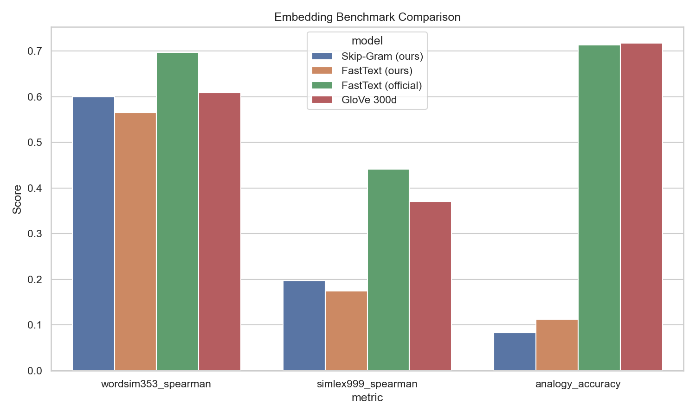
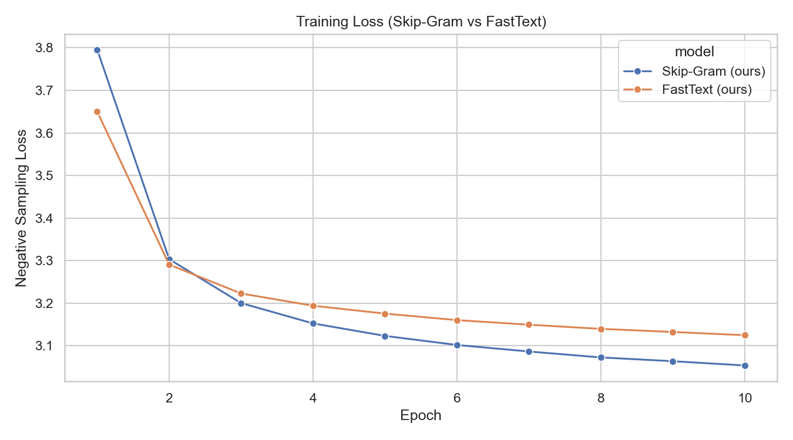
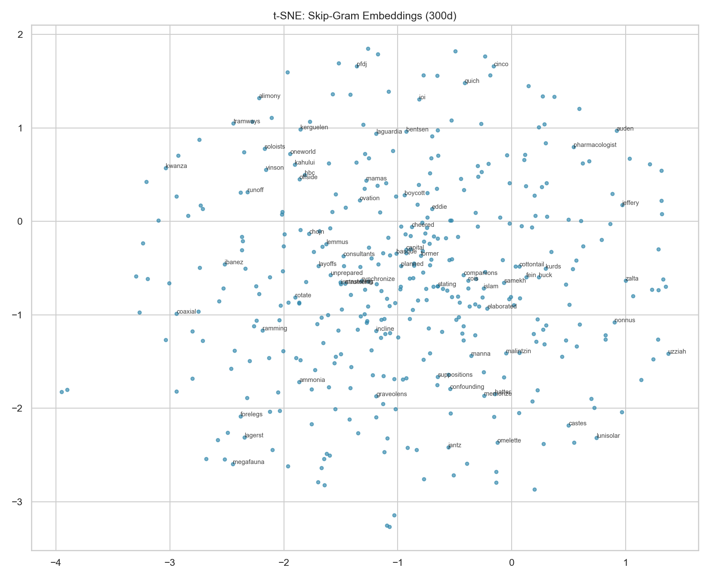
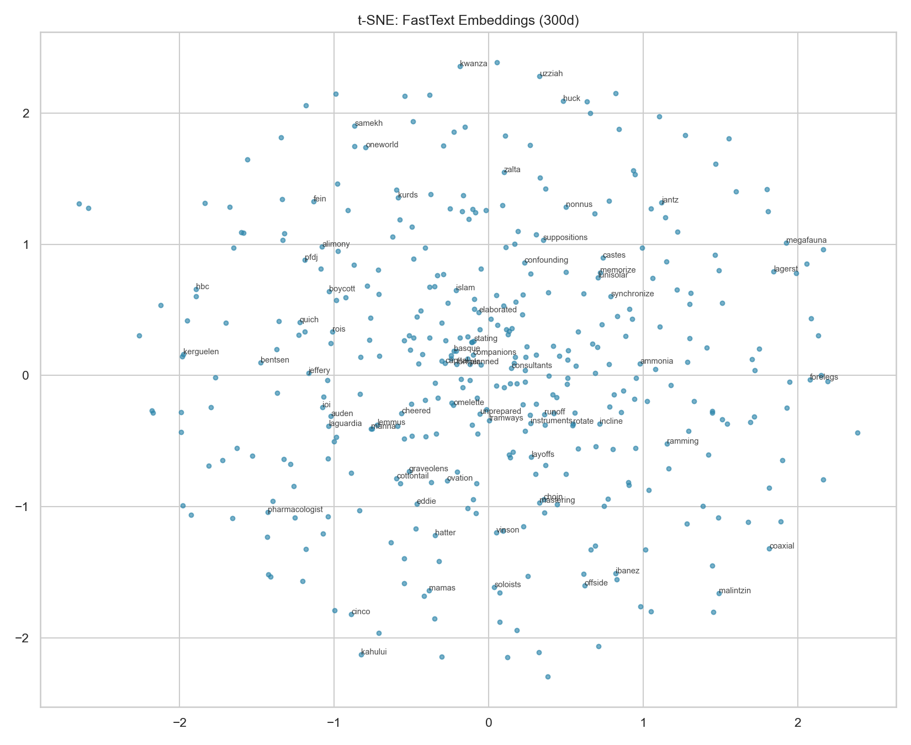
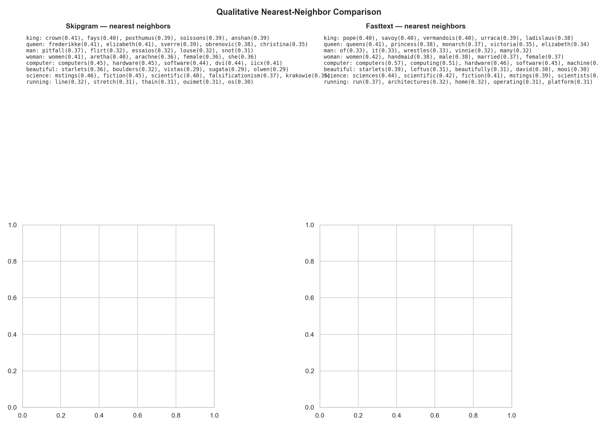

# FastText Subword Embeddings Trained from Scratch

[](LICENSE)

**Repository:** [github.com/bachnguyennn/Fast-Text-Embedding-System](https://github.com/bachnguyennn/Fast-Text-Embedding-System)

A from-scratch **PyTorch** implementation of Skip-Gram with Negative Sampling and **FastText subword n-grams**, trained on the [text8](http://mattmahoney.net/dc/text8.zip) corpus (~17M tokens). The project compares a plain Skip-Gram baseline against FastText on the same data, and benchmarks both against **official pre-trained FastText** and **GloVe 300d** via Gensim.

## Motivation

Word embeddings map tokens to dense vectors that capture semantic similarity. Classic Skip-Gram (Word2Vec) learns one vector per word, which fails on rare or out-of-vocabulary (OOV) tokens. **FastText** extends Skip-Gram by representing each word as the sum of its word vector and its character n-gram vectors (typically 3–6 characters). That makes embeddings more robust to morphology, typos, and unseen words.

This repository implements the full pipeline—tokenization, vocabulary, subsampling, negative sampling, streaming training, intrinsic evaluation, and visualization—so the effect of subword information can be measured directly.

## Architecture

```
Input word "where"
  ├── word embedding:     E_word["where"]
  └── subword embeddings: E_sub["<wh"], E_sub["<whe"], ... , E_sub["ere>"]
  => input vector = E_word + mean(E_sub[ngrams])

Skip-Gram + Negative Sampling:
  maximize log σ(v_center · v_context) + Σ log σ(-v_center · v_negative)
```

## Project Structure

```
fasttext_embeddings_from_scratch/
├── src/                       # tokenizer, vocab, dataset, model, trainer
├── evaluation/                # WordSim, analogy, 4-model comparison
├── scripts/
│   ├── train_portfolio_models.py   # 300d, 10 epochs, full text8
│   ├── export_checkpoint.py        # recover .vec after training (OOM-safe)
│   ├── download_baselines.py
│   ├── generate_report_figures.py
│   └── post_train_pipeline.sh      # evaluate + figures after training
├── notebook/                  # interactive report
├── reports/figures/           # README visuals
├── models/                    # .vec exports (gitignored)
├── train.py / evaluate.py / visualize.py
└── README.md
```

## Quick Start

### Clone & environment

```bash
git clone https://github.com/bachnguyennn/Fast-Text-Embedding-System.git
cd Fast-Text-Embedding-System
python -m venv venv && source venv/bin/activate
pip install -r requirements.txt
```

### Portfolio training (recommended)

Full-quality training uses **300 dimensions**, **10 epochs**, **full text8** with Word2vec subsampling and streaming skip-gram pairs (no token/pair caps):

```bash
# ~20+ hours on Apple MPS (~60 min/epoch); run overnight with caffeinate
caffeinate -dims nohup python scripts/train_portfolio_models.py > logs/train_portfolio.log 2>&1 &

# After training finishes:
bash scripts/post_train_pipeline.sh
```

If export hits MPS OOM at the end of FastText training, recover without retraining:

```bash
python scripts/export_checkpoint.py --checkpoint models/fasttext_best.pt
```

Configurable via CLI:

```bash
python train.py --model-type fasttext --epochs 10 --embedding-dim 300 --streaming --subsample
```

### Baselines & evaluation

```bash
python scripts/download_baselines.py   # caches gensim models
python evaluate.py                     # all 4 models → reports/comparison_results.csv
python scripts/generate_report_figures.py
```

### Notebook

```bash
jupyter notebook notebook/fasttext_from_scratch_report.ipynb
```

For a quick demo in the notebook, use `MAX_TOKENS = 1_000_000`. For portfolio parity, prefer `scripts/train_portfolio_models.py`.

## Training Configuration (portfolio)

| Setting | Value |
|---------|-------|
| Corpus | Full text8 (17,005,279 raw tokens) |
| Subsampling | Word2vec (threshold 1e-5) → ~4.98M tokens/epoch |
| Epochs | **10** (configurable via `--epochs`) |
| Embedding dim | **300** |
| Window | 5 |
| Negative samples | 15 |
| Batch size | 1024 |
| Optimizer | Adam (lr=0.0025) + ReduceLROnPlateau |
| Pair generation | Streaming (on-the-fly, no RAM blow-up) |
| Word vocab | 71,292 | Subword vocab | 333,222 |

**Final training loss (epoch 10):** Skip-Gram 3.05 · FastText 3.12

## Results

Intrinsic evaluation on **WordSim-353**, **SimLex-999**, and **Google analogy** questions. All custom models trained on full subsampled text8 at **300d × 10 epochs**. Official baselines: Gensim `fasttext-wiki-news-subwords-300` and `glove-wiki-gigaword-300`.

| Model | WordSim-353 ρ | SimLex-999 ρ | Analogy accuracy | WordSim coverage |
|-------|---------------|--------------|------------------|------------------|
| **Skip-Gram (ours)** | **0.60** | 0.20 | 8.3% (1,506 / 18,104) | 99.4% |
| **FastText (ours)** | 0.56 | 0.17 | **11.3%** (2,207 / 19,544) | **100%** |
| FastText (official, 300d) | **0.70** | **0.44** | **71.3%** (11,293 / 15,845) | 100% |
| GloVe 300d | 0.61 | 0.37 | 71.7% (14,020 / 19,544) | 100% |

Raw metrics: [`reports/comparison_results.csv`](reports/comparison_results.csv)

### Benchmark comparison



### Training loss



### Embedding space (t-SNE)





### Nearest neighbors (qualitative)



After full 300d training, both models produce sensible semantic and morphological neighbors (see figure above). FastText tends to link inflected forms (`computer` → `compute`, `computing`) via character n-grams.

## Key Insights

1. **Full-corpus training matters**: Moving from a 100d pilot (1M tokens, 3 epochs) to **300d × 10 epochs on full text8** raised WordSim ρ from ~0.02 to **~0.56–0.60**—approaching GloVe (0.61) on the same benchmarks, though still below official FastText (0.70).
2. **FastText wins on coverage and analogies**: At equal training setup, FastText reaches **100% WordSim coverage** and **11.3% analogy accuracy** vs Skip-Gram’s 99.4% / 8.3%, because subword n-grams supply vectors for rare and OOV-like forms.
3. **Skip-Gram can edge WordSim on in-vocab pairs**: Our Skip-Gram slightly beats our FastText on WordSim-353 (0.60 vs 0.56), likely because subword averaging smooths word vectors; FastText’s advantage shows up in coverage and analogy volume.
4. **Official models still dominate analogies**: Wikipedia + news Crawl pre-training yields **~71% analogy accuracy** vs **~11%** for from-scratch text8—data scale dominates for relational reasoning.
5. **Engineering lessons**: Streaming pairs + subsampling fit full text8 in RAM; batched CPU export avoids MPS OOM when writing 71k composed FastText vectors.

## Implementation Highlights

| Component | Details |
|-----------|---------|
| Tokenizer | Lowercasing, punctuation removal, FastText 3–6 char n-grams with `<` `>` boundaries |
| Vocabulary | Min frequency = 5, `<UNK>` / `<PAD>`, unigram^0.75 negative sampling |
| Training | Streaming skip-gram dataset, Word2vec subsampling |
| Models | `SkipGramModel`, `FastTextModel` (word + mean subword on input) |
| Evaluation | Vectorized analogy for custom `.vec`; Gensim `most_similar` for official models |
| Export | Word2vec-compatible `.vec`; batched CPU export for large vocabs |

## What is not in Git

Large artifacts are **gitignored**: `data/raw/text8`, `models/*.vec`, `models/*.pt`, `venv/`. Benchmark CSV/JSON, training histories, and `reports/figures/*.png` are included for portfolio visibility.

## Notebook

[`notebook/fasttext_from_scratch_report.ipynb`](notebook/fasttext_from_scratch_report.ipynb) — EDA, training, neighbors, benchmarks, t-SNE, error analysis.

## License

See [LICENSE](LICENSE).
